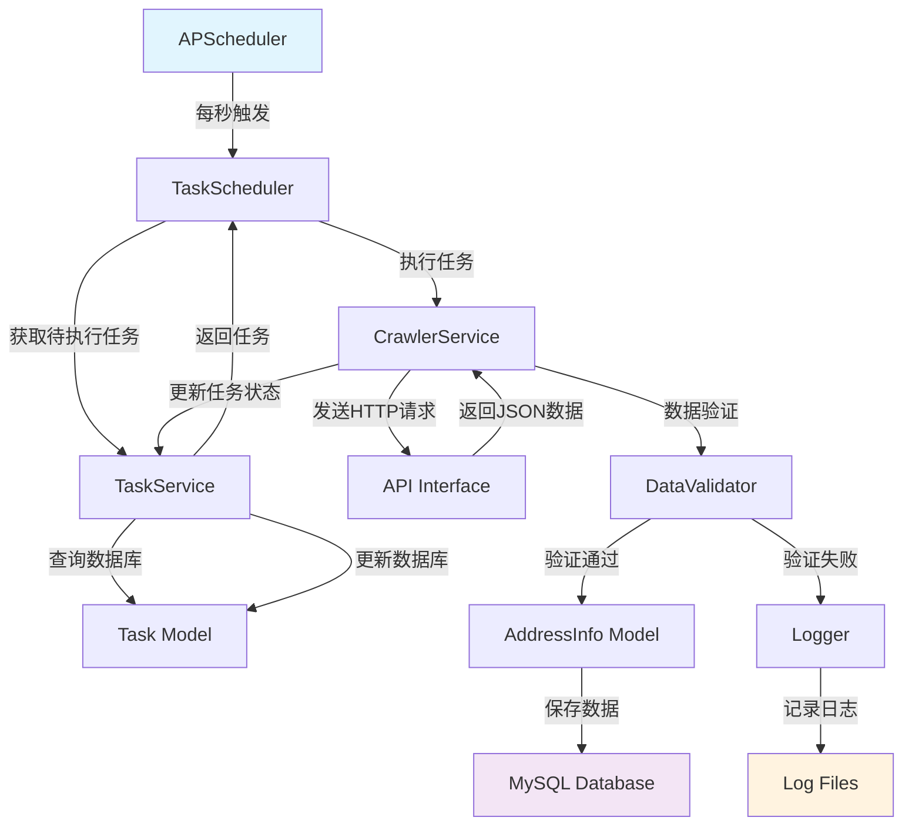

# Design Document

## Overview

地址爬虫功能将构建一个完整的自动化地址数据采集系统，通过Flask框架集成APScheduler实现定时任务调度，使用SQLAlchemy ORM进行数据库操作，从指定API接口获取地址数据并存储到MySQL数据库。该系统遵循分层架构设计，包含数据模型层、服务层、调度层，确保代码结构清晰、易于维护和扩展。

## Steering Document Alignment

### Technical Standards (tech.md)
- **Python 3.11**: 使用最新稳定版本，遵循PEP 8编码规范
- **Flask框架**: 轻量级Web框架，适合构建简单爬虫应用
- **SQLAlchemy ORM**: 简化数据库操作，避免手写SQL语句
- **APScheduler**: 内置定时任务支持，配置简单可靠
- **MySQL数据库**: 本地关系型数据库，存储结构化地址数据
- **requests库**: 处理HTTP请求，支持API调用
- **Python logging**: 标准日志模块，提供完整的日志记录功能

### Project Structure (structure.md)
- **分层架构**: models/ (数据层) → services/ (服务层) → scheduler/ (调度层)
- **模块化设计**: 爬虫逻辑、任务管理、数据存储分离
- **命名规范**: snake_case文件命名，PascalCase类名，遵循PEP 8
- **导入顺序**: 标准库 → 第三方库 → 本地模块
- **代码组织**: 单一职责原则，每个模块专注于特定功能

## Code Reuse Analysis

### Existing Components to Leverage
由于这是新建项目，暂无现有组件可复用。将基于Flask生态系统的标准实践构建所有组件。

### Integration Points
- **MySQL数据库**: 使用SQLAlchemy ORM连接，遵循转向文档中的数据库URL配置
- **API接口**: 集成https://www.meiguodizhi.com/api/v1/dz，处理JSON响应格式
- **日志系统**: 基于Python标准logging模块，支持文件轮转和级别控制
- **定时调度**: 集成APScheduler到Flask应用，实现每秒任务触发

## Architecture



## Components and Interfaces

### Component 1: TaskScheduler (调度器)
- **Purpose**: 管理定时任务执行，每秒检查并触发待执行的爬虫任务
- **Interfaces**: 
  - `start_scheduler()`: 启动定时调度器
  - `stop_scheduler()`: 停止定时调度器
  - `execute_pending_tasks()`: 执行待处理任务
- **Dependencies**: APScheduler, TaskService, Logger
- **Reuses**: APScheduler的BackgroundScheduler用于后台任务调度

### Component 2: TaskService (任务服务)
- **Purpose**: 管理爬虫任务的生命周期，包括创建、查询、状态更新
- **Interfaces**:
  - `create_task(url, method, total_num, **kwargs)`: 创建新任务
  - `get_pending_task()`: 获取待执行任务
  - `update_task_status(task_id, status, increment=True)`: 更新任务状态
  - `get_task_statistics()`: 获取任务统计信息
- **Dependencies**: Task Model, Database, Logger
- **Reuses**: SQLAlchemy ORM进行数据库操作

### Component 3: CrawlerService (爬虫服务)
- **Purpose**: 执行具体的爬虫逻辑，包括API调用、数据解析、数据存储
- **Interfaces**:
  - `crawl_address(task)`: 执行地址爬取任务
  - `parse_api_response(response_data)`: 解析API响应数据
  - `save_address_data(address_data, source_url)`: 保存地址数据
  - `handle_api_error(status_code, response)`: 处理API错误
- **Dependencies**: requests库, AddressInfo Model, DataValidator, Logger
- **Reuses**: requests库处理HTTP请求，SQLAlchemy进行数据持久化

### Component 4: DataValidator (数据验证器)
- **Purpose**: 验证爬取到的地址数据，确保数据质量和完整性
- **Interfaces**:
  - `validate_address_data(data)`: 验证地址数据完整性
  - `check_duplicate_address(address, telephone)`: 检查重复地址
  - `sanitize_telephone(telephone)`: 清理电话号码格式
  - `truncate_long_fields(data)`: 截断过长字段
- **Dependencies**: AddressInfo Model, Logger
- **Reuses**: SQLAlchemy查询进行重复性检查

### Component 5: Logger (日志管理器)
- **Purpose**: 统一管理日志记录，支持文件轮转和多级别输出
- **Interfaces**:
  - `info(message, **kwargs)`: 记录信息日志
  - `error(message, exception=None, **kwargs)`: 记录错误日志
  - `warning(message, **kwargs)`: 记录警告日志
  - `debug(message, **kwargs)`: 记录调试日志
- **Dependencies**: Python logging模块
- **Reuses**: logging的RotatingFileHandler实现日志文件轮转

## Data Models

### Task Model
```python
class Task(db.Model):
    __tablename__ = 'tasks'
    
    id = db.Column(db.Integer, primary_key=True, autoincrement=True)
    url = db.Column(db.String(500), nullable=False)
    method = db.Column(db.String(10), nullable=False, default='GET')
    body = db.Column(db.Text, nullable=True)
    headers = db.Column(db.Text, nullable=True)
    total_num = db.Column(db.Integer, nullable=False)
    visited_num = db.Column(db.Integer, nullable=False, default=0)
    status = db.Column(db.String(20), nullable=False, default='pending')
    timeout = db.Column(db.Integer, nullable=False, default=30)
    retry_count = db.Column(db.Integer, nullable=False, default=0)
    created_at = db.Column(db.DateTime, nullable=False, default=datetime.utcnow)
    updated_at = db.Column(db.DateTime, nullable=False, default=datetime.utcnow, onupdate=datetime.utcnow)
```

### AddressInfo Model
```python
class AddressInfo(db.Model):
    __tablename__ = 'address_info'
    
    id = db.Column(db.Integer, primary_key=True, autoincrement=True)
    address = db.Column(db.String(1024), nullable=False)
    telephone = db.Column(db.String(20), nullable=True)
    city = db.Column(db.String(100), nullable=True)
    zip_code = db.Column(db.String(20), nullable=True)
    state = db.Column(db.String(50), nullable=True)
    state_full = db.Column(db.String(100), nullable=True)
    country = db.Column(db.String(100), nullable=True, default='USA')
    source_url = db.Column(db.String(500), nullable=True)
    created_at = db.Column(db.DateTime, nullable=False, default=datetime.utcnow)
    updated_at = db.Column(db.DateTime, nullable=False, default=datetime.utcnow, onupdate=datetime.utcnow)
```

## Error Handling

### Error Scenarios
1. **API限流错误（429状态码）**
   - **处理**: 等待60秒后自动重试，最多重试3次
   - **用户影响**: 日志中记录限流信息，不影响其他任务执行

2. **网络连接超时**
   - **处理**: 记录超时错误，跳过当前任务，继续执行下一个任务
   - **用户影响**: 控制台显示超时警告，不影响系统整体运行

3. **数据验证失败**
   - **处理**: 记录验证错误详情，跳过无效数据，继续处理下一条数据
   - **用户影响**: 日志显示具体的验证失败原因

4. **数据库连接失败**
   - **处理**: 尝试重新连接，最多重试5次，记录连接失败错误
   - **用户影响**: 控制台显示数据库连接错误，系统继续运行其他任务

5. **重复数据检测**
   - **处理**: 检测到重复地址时跳过保存，记录跳过的原因
   - **用户影响**: 日志显示数据跳过信息，保证数据唯一性

6. **系统异常**
   - **处理**: 捕获所有未处理异常，记录异常信息和堆栈跟踪
   - **用户影响**: 系统保持运行状态，单个任务失败不影响整体运行

## Testing Strategy

### Unit Testing
- **模型层测试**: 验证Task和AddressInfo模型的数据完整性和约束
- **服务层测试**: 测试TaskService的任务管理功能和CrawlerService的爬虫逻辑
- **验证器测试**: 测试DataValidator的数据验证和清理功能
- **日志测试**: 验证Logger的各级别日志输出和文件轮转功能

### Integration Testing
- **数据库集成**: 测试SQLAlchemy ORM与MySQL数据库的连接和操作
- **API集成**: 测试与https://www.meiguodizhi.com/api/v1/dz的实际调用和数据获取
- **调度器集成**: 测试APScheduler的定时任务触发和执行
- **错误处理集成**: 测试各种错误场景下的系统行为和恢复机制

### End-to-End Testing
- **完整爬虫流程**: 从任务创建到数据存储的完整流程测试
- **并发任务处理**: 测试多个任务同时执行时的系统表现
- **系统稳定性**: 长时间运行测试，验证系统的稳定性和资源使用
- **数据质量验证**: 验证数据去重、验证、清理功能的有效性